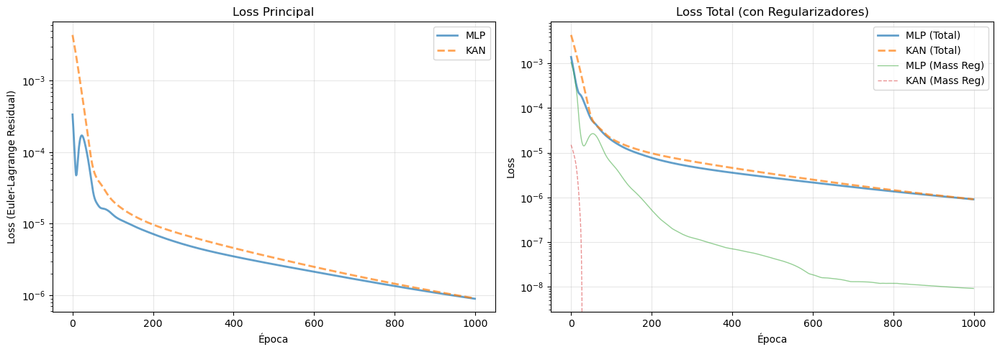
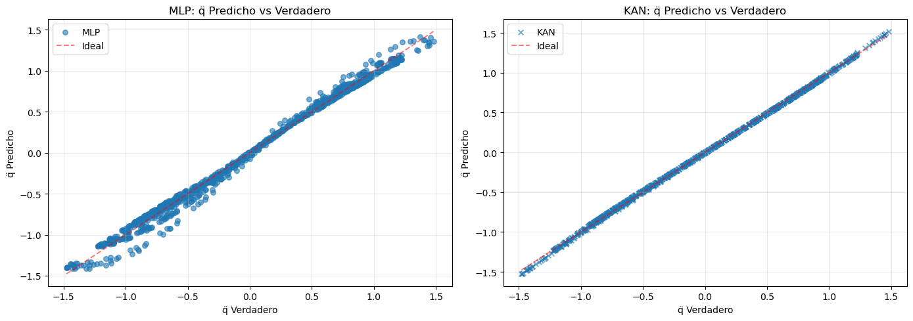
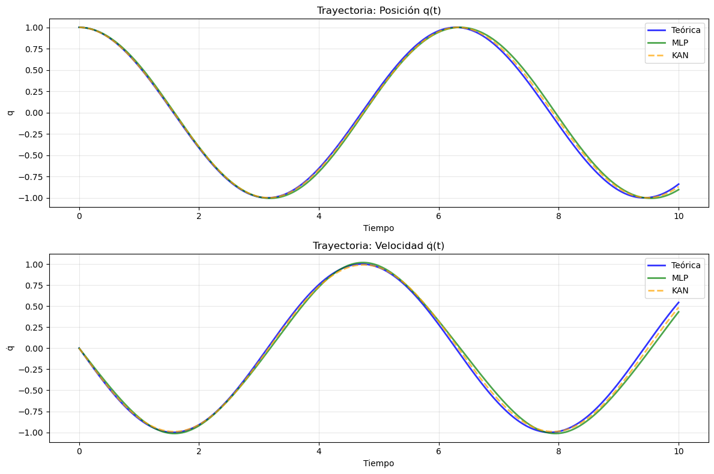
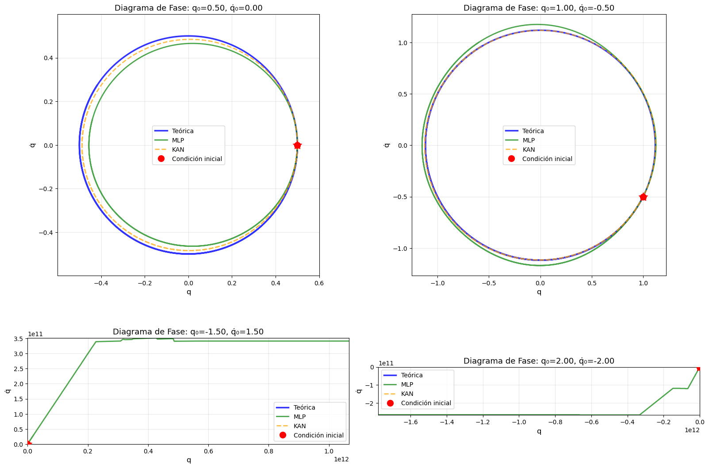
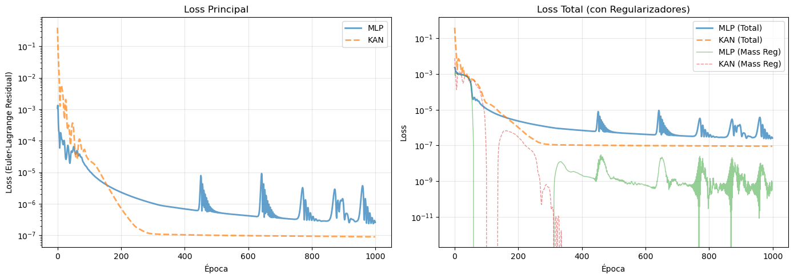
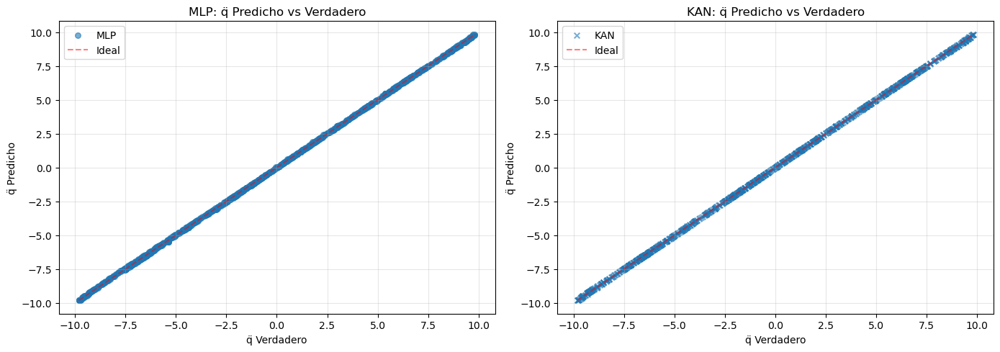
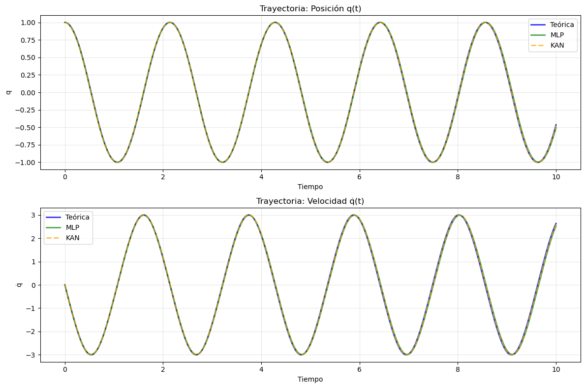
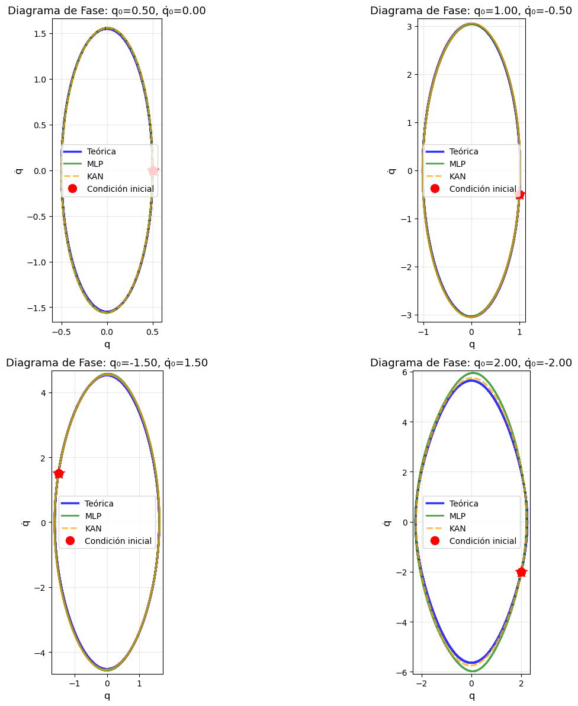
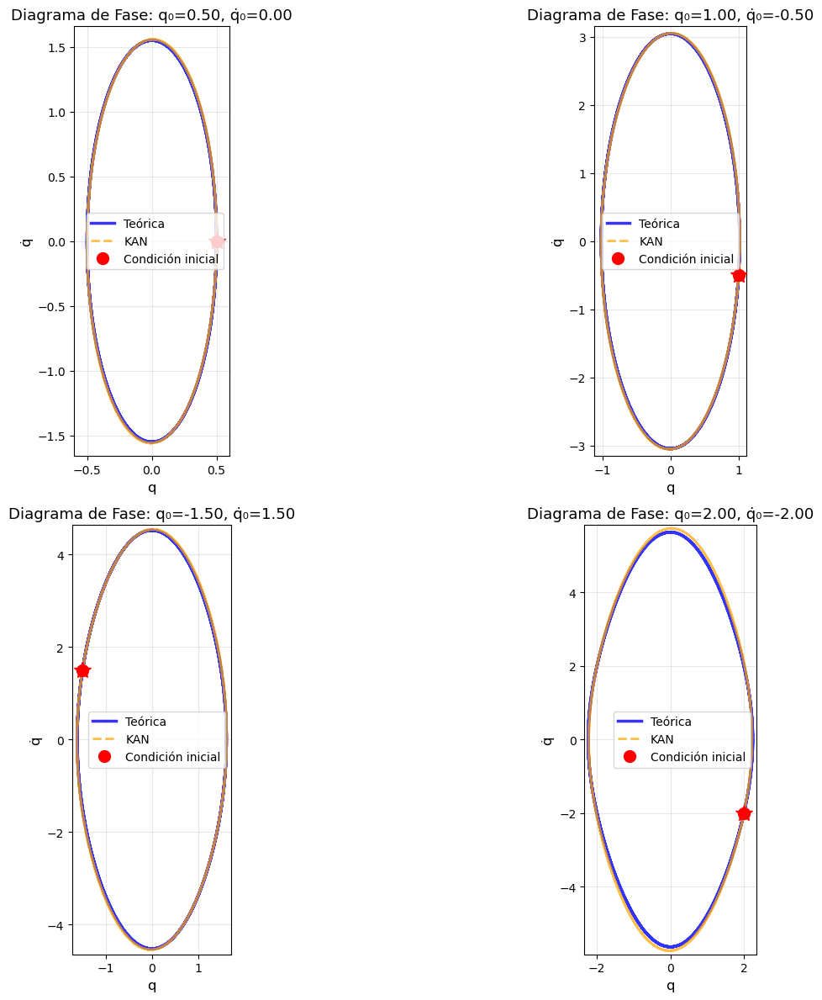

# lagrangian_kan

Framework para aprendizaje y descubrimiento de Lagrangianos usando KAN (Kolmogorov-Arnold Networks).

**Nota**: Este proyecto es un ejemplo de aplicación de [mini_kan](https://github.com/PoppinElo/mini_kan), una implementación simple y modular de KAN (Kolmogorov-Arnold Networks).

## Prioridades de Diseño

1. **Modularidad**: Componentes independientes y reutilizables
2. **Legibilidad**: Código claro y bien documentado
3. **Didáctica**: Explicaciones explícitas de conceptos físicos
4. **Optimicidad**: Uso eficiente de autograd y operaciones vectorizadas

## Estructura

```
lagrangian_kan/
├── systems/          # Sistemas físicos con Lagrangiano
├── lagrangian/       # Núcleo: Lagrangiano y Euler-Lagrange
├── losses/          # Funciones de pérdida
├── training/        # Entrenamiento
├── data/            # Generación de datos
└── utils/           # Utilidades (visualización, métricas)
```

## Características

- Soporte para sistemas multidimensionales (1D, 2D, 3D, ...)
- Aprendizaje de Lagrangiano desde trayectorias
- Descubrimiento de Lagrangiano (sin L conocido)
- Resolución de ecuaciones de Euler-Lagrange usando autograd
- Integración numérica de trayectorias
- Múltiples funciones de pérdida

## Uso Básico

```python
from lagrangian_kan import HarmonicOscillator, LagrangianTrainer
from mini_kan import KAN, KANLayer
from mini_kan.basis import MonomialBasis

# 1. Crear sistema físico
system = HarmonicOscillator(n_dof=1, m=1.0, k=1.0)

# 2. Generar datos
train_data = system.generate_trajectories(n_trajectories=50)

# 3. Crear modelo
model = KAN(layers=[...])

# 4. Entrenar
trainer = LagrangianTrainer()
trainer.train(model, train_data, loss_type="euler_lagrange")

# 5. Evaluar
metrics = trainer.evaluate(model, test_data)
```

## Sistemas Físicos Soportados

- **HarmonicOscillator**: Oscilador armónico (1D y multidimensional)
- **SimplePendulum**: Péndulo simple con restricciones energéticas

## Tipos de Loss

1. **EulerLagrangeResidualLoss**: Minimiza residuo de Euler-Lagrange (loss principal)
2. **AccelerationRegularizer**: Regulariza q̈ predicho vs q̈ verdadero (opcional)
3. **MassRegularizer**: Regulariza la matriz de masa M = ∂²L/∂q̇² (opcional)
4. **InteractionRegularizer**: Regulariza interacciones ∂²L/(∂q∂q̇) (opcional)

## Requisitos

- Python 3.8+
- PyTorch >= 2.0.0
- NumPy >= 1.20.0
- SciPy >= 1.7.0
- Matplotlib >= 3.5.0
- [mini_kan](https://github.com/PoppinElo/mini_kan) (framework de KAN base)

## Instalación

```bash
# 1. Instalar mini_kan primero
git clone https://github.com/PoppinElo/mini_kan.git
cd mini_kan
pip install -e .

# 2. Instalar lagrangian_kan
cd ..
git clone https://github.com/PoppinElo/lagrangian_kan.git
cd lagrangian_kan
pip install -e .
```

## Ejemplos

Ver `example_simple.py` para un ejemplo completo.

Los notebooks de ejemplo están disponibles en el repositorio principal:
- `HarmonicOscillator.ipynb`: Ejemplo completo con oscilador armónico
- `SimplePendulum.ipynb`: Ejemplo con péndulo simple

## Resultados y Visualizaciones

A continuación se muestran ejemplos visuales de las capacidades del modelo KAN para aprender Lagrangianos:

### Oscilador Armónico

El modelo KAN aprende exitosamente el Lagrangiano del oscilador armónico y reproduce correctamente las trayectorias físicas.

**Datos generados y distribución:**


**Métricas de entrenamiento:**


**Comparación MLP vs KAN:**


**Diagramas de fase:**


**Trayectorias integradas:**


### Péndulo Simple

El modelo KAN también puede aprender sistemas no lineales como el péndulo simple, respetando las restricciones energéticas del sistema.

**Datos generados y distribución:**


**Métricas de entrenamiento:**


**Comparación MLP vs KAN:**


**Diagramas de fase:**


**Trayectorias integradas:**


Estos resultados demuestran que los modelos KAN pueden aprender eficientemente las dinámicas Lagrangianas desde datos de trayectorias, superando o igualando el rendimiento de MLPs tradicionales mientras proporcionan mayor interpretabilidad.

### Nota sobre Complejidad

Los ejemplos mostrados (oscilador armónico y péndulo simple) son casos relativamente simples con baja dimensionalidad y comportamiento bien caracterizado. Para sistemas más complejos con:

- **Mayor no-linealidad**: Sistemas con dinámicas altamente no lineales o caóticas
- **Mayor dimensionalidad**: Sistemas con múltiples grados de libertad acoplados
- **Restricciones complejas**: Sistemas con restricciones holonómicas o no-holonómicas

se requiere una **mayor calibración** en varios aspectos:

1. **Diseño de la red**: Selección cuidadosa de la arquitectura KAN (número de capas, nodos por capa, funciones base)
2. **Regularizadores**: Ajuste fino de los pesos de los regularizadores (masa, interacciones, aceleración)
3. **Generación de datos**: Estrategias más sofisticadas para cubrir el espacio de fases de manera adecuada
4. **Hiperparámetros de entrenamiento**: Tasa de aprendizaje, esquemas de regularización, y estrategias de optimización

El framework proporciona las herramientas necesarias, pero la aplicación exitosa a problemas más complejos requiere experiencia y experimentación con estos aspectos.

## Relación con mini_kan

Este proyecto demuestra cómo usar [mini_kan](https://github.com/PoppinElo/mini_kan) para resolver problemas físicos complejos. `lagrangian_kan` utiliza los componentes de `mini_kan` (KAN, KANLayer, bases) para aprender Lagrangianos desde datos de trayectorias.

## Licencia

[Mismo que mini_kan]
